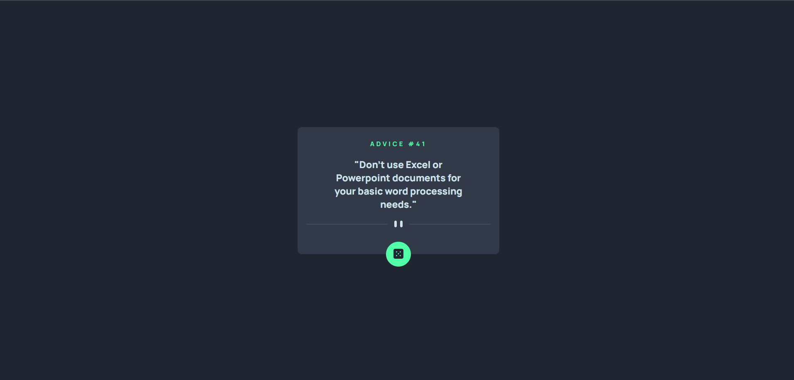

# Frontend Mentor - Advice Generator 

Essa é a minha solução para o desafio [Advice Generator challenge on Frontend Mentor](https://www.frontendmentor.io/challenges/advice-generator-app-QdUG-13db).

## Sumário

- [Visão Geral](#visão-geral)
  - [Desafio](#desafio)
  - [Print](#print)
  - [Links](#links)
- [Meu processo](#meu-processo)
  - [Tecnologias](#tecnologias)
  - [Pratica de Aprendizado](#pratica-de-aprendizado)
  - [Habilidades em Desenvolvimento](#habilidades-em-desenvolvimento)
- [Autor](#autor)
- [Agradecimentos](#agradecimentos)

## Visão Geral

### Desafio

- Fazer o projeto da maneira mais fiel possível ao design dado.

### Print



### Links

- Solução: [Ir para solução](https://vinicius-b-oliveira.github.io/advice-generator/)

## Meu Processo

### Tecnologias

- Marcação semantica com HTML 5
- Folhas de estilo em cascata no CSS 3
- Estilos flexiveis usando CSS Flexbox
- Armazenamento de propriedades usando variáveis CSS
- Git para versionamento de código
- Uso de API com JavaScript

### Pratica de Aprendizado

Esse projeto me proporcionou um avanço no entendimento do funcionamento das APIs e do próprio JavaScript. 

Segue abaixo um trecho de código com os conhecimentos relatados acima: 
```javascript
async function gerarConselho() {
    const url = "https://api.adviceslip.com/advice"
    const resposta = await fetch(url)
    const json = await resposta.json()
    const id = `Advice # ${json.slip.id}`
    const text = json.slip.advice

    adviceId.innerHTML = id
    advice.innerHTML = text
}
```

### Habilidades em Desenvolvimento

Mesmo contente com o resultado obtido, acredito que o "Clean Code" ainda é algo que pretendo sempre melhorar. Estarei sempre na busca por escrever códigos limpos e fáceis de entender. 

## Autor

- Github - [Vinicíus Bueno](https://github.com/Vinicius-b-oliveira)
- Frontend Mentor - [Vinicíus Bueno](https://www.frontendmentor.io/profile/Vinicius-b-oliveira)

## Agradecimentos

Projeto realizado durante o curso de programação [Dev Quest](https://devemdobro.com/matriculas-abertas/) sobre mentoria dos gêmeos Ricardo Dias e Roberto Dias. 